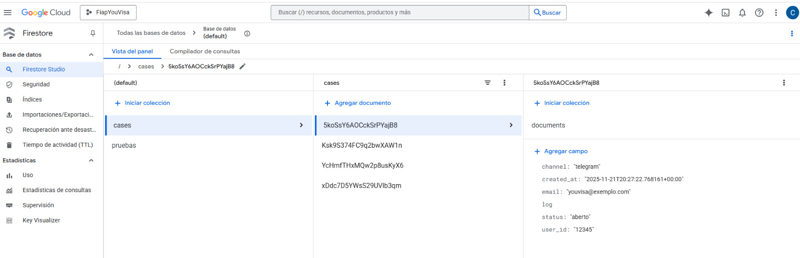
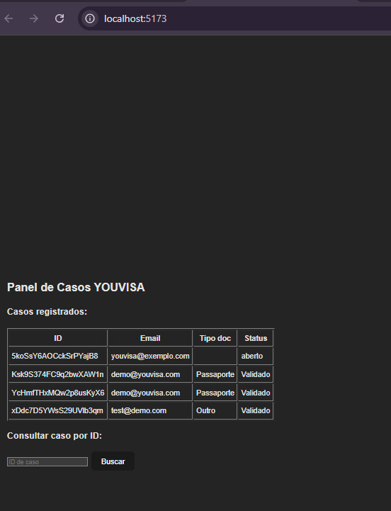
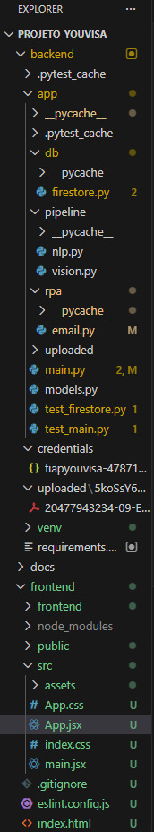
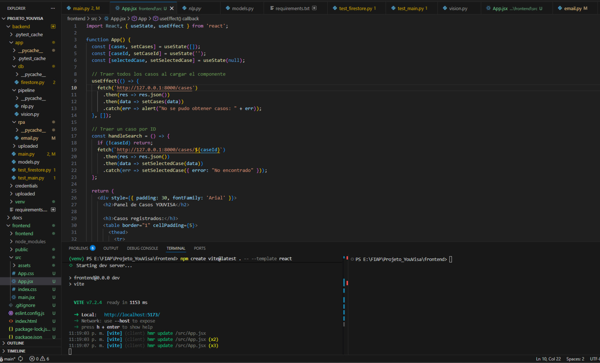

# FIAP - Faculdade de Informática e Administração Paulista

<p align="center">
<a href= "https://www.fiap.com.br/"></a>
</p>

<br>

# 🤖 YOUVISA – Plataforma Inteligente de Atendimento Multicanal
## 🚀 Entrega: Sprint 2

> **Descrição:** Solução de automação inteligente para serviços consulares, integrando classificação via NLP, validação visual e RPA.

---

## 👨‍🎓 Integrantes: Grupo 22

| Nome | LinkedIn | Papel no Projeto |
| :--- | :--- | :--- |
| **Ana Beatriz Duarte Domingues** | [Perfil](https://www.linkedin.com/in/) | Automação (RPA) & Documentação |
| **Junior Rodrigues da Silva** | [Perfil](https://www.linkedin.com/in/jrsilva051/) | Backend API & Chatbot Intelligence |
| **Carlos Emilio Castillo Estrada** | [Perfil](https://www.linkedin.com/in/) | Banco de Dados & Infraestrutura |

---
## 📦 Links Rápidos da Entrega
Acesse rapidamente os itens entregáveis:

*  **Demonstração Funcional (Vídeo):** [Assistir no YouTube](https://youtu.be/V565bE4z80I?si=4o52oVuZAJQVWOTS)
*  **Relatório Técnico (PDF):** [Acessar Relatório Completo](docs/relatorio_tecnico.md)
*  **Código Fonte:** Disponível nas pastas `backend/app` e `frontend`.

---

## 📌 Visão Geral do Projeto

A **YOUVISA** otimiza serviços consulares utilizando tecnologias de Inteligência Artificial, RPA, NLP e Visão Computacional. 

Nesta **Sprint 2**, entregamos o backend funcional que realiza:
1.  **Classificação Inteligente:** Identifica se o arquivo é passaporte, RG ou formulário.
2.  **Validação Visual:** Verifica integridade e formato.
3.  **RPA Ativo:** Envia e-mail automático de confirmação ou erro para o usuário.
4.  **Rastreabilidade:** Grava cada passo no Google Firestore.

---

## 🔗 Diagrama de Arquitetura
Usuario/Chatbot
      ↓
Backend FastAPI
      ↓
Pipeline: NLP → Visión → RPA (email)
      ↓
Firestore
      ↓
Panel agente / Swagger UI / Frontend

---

## 📸 Evidências de Validação (Screenshots)

Abaixo apresentamos as evidências visuais dos testes realizados no protótipo funcional.

### 1. API e Documentação (Swagger UI)
*Interface onde os endpoints são testados. É possível ver as rotas `/upload` (para envio de arquivos) e `/cases` (para consulta).*


### 2. Persistência de Dados (Google Firestore)
*Banco de dados em nuvem registrando o caso com ID único, e-mail do usuário e status "aberto" após o upload.*


### 3. Painel do Agente (Frontend React)
*Interface visual desenvolvida em React + Vite, consumindo a API para listar os casos processados.*


### 4. Estrutura e Ambiente de Desenvolvimento
*Visão do ambiente (VS Code) demonstrando a organização modular das pastas (`backend`, `frontend`, `pipeline`) e o servidor rodando.*
<p align="center">
  
  
</p>

---

## 🛠️ Tecnologias Utilizadas

| Módulo | Tecnologia | Descrição |
| :--- | :--- | :--- |
| **Backend** | FastAPI + Python | API REST e orquestração do pipeline de automação. |
| **Banco de Dados** | Google Firestore | Armazenamento NoSQL de documentos e logs de casos. |
| **IA / NLP** | Python (Logic/Regex) | Classificação automática de tipos documentais. |
| **Visão Comp.** | Python / OpenCV | Validação estrutural de arquivos (extensão/formato). |
| **RPA / Email** | SMTP + Python | Envio automático de confirmações para o usuário. |
| **Frontend** | React + Vite | Painel do agente para visualização de casos. |
| **Controle** | Git & GitHub | Versionamento e colaboração. |

---

## 📂 Estrutura do Repositório

```bash
src/
│
├─ backend/
│ ├─ app/             # Aplicação Principal
│ │  ├─ pipeline/     # Módulos de IA (NLP e Visão)
│ │  ├─ rpa/          # Scripts de automação de e-mail
│ │  └─ db/           # Conexão com Firestore
│ ├─ credentials/     # Credenciais (GitIgnored)
│ └─ requirements.txt # Dependências Python
│
├─ frontend/          # Interface React (Painel do Agente)
├─ assets/            # Evidências (Imagens)
├─ Relatório Técnico (PDF)/
└─ Link vídeo de demonstração do projeto/ 

```

## ⚡ Guia de Execução Rápida

### 1. Configuração do Backend (API)
```bash
# 1. Clone o repositório
git clone [https://github.com/caliraselph/YouVisa_Sprint2.git](https://github.com/caliraselph/YouVisa_Sprint2.git)
cd YouVisa_Sprint2/src/backend

# 2. Crie e ative o ambiente virtual
python -m venv venv
# Windows: .\venv\Scripts\Activate.ps1
# Mac/Linux: source venv/bin/activate

# 3. Instale as dependências
pip install -r requirements.txt

# 4. Execute o servidor
uvicorn app.main:app --reload
```
O backend estará rodando em: `http://127.0.0.1:8000/docs`

### 2. Configuração do Frontend
```bash
cd ../frontend
npm install
npm run dev
```

### 3. Configurações Necessárias (.env)
Para o funcionamento completo (E-mail e Banco), certifique-se de configurar:
- Arquivo serviceAccount.json na pasta /credentials (Google Firestore).
- Variáveis de ambiente ou arquivo de config para o SMTP (Gmail App Password).

---

## 🧾 ** Histórico de Versões**

---
| Versão    | Data       | Descrição                                        |
| :-------- | :--------- | :----------------------------------------------- |
| **0.2.0** | 04/11/2025 | Refatoração da arquitetura para Google Cloud: Google Cloud Run, Google Firestore, FastAPI e LangChain com Gemini Flash. |
| **0.1.0** | 09/10/2024 | Criação do documento e definição da arquitetura. |
